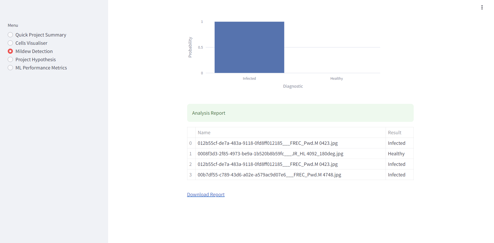
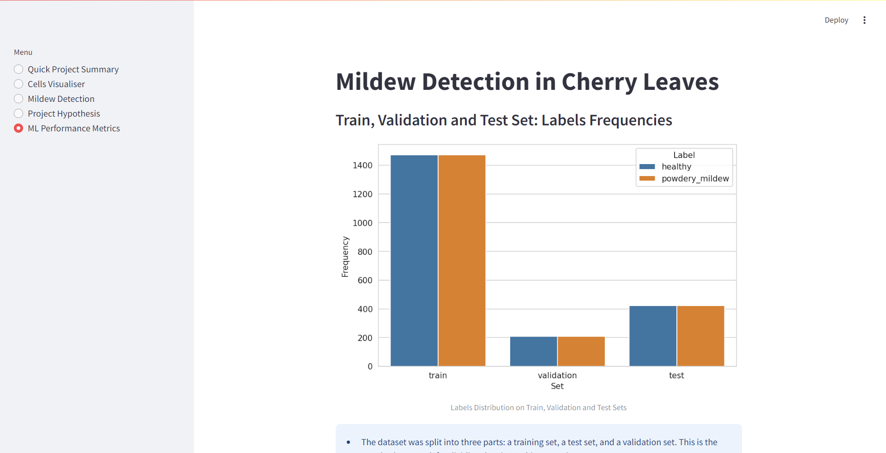

# Mildew Detection in Cherry Leaves

This project applies data science and machine learning to distinguish between healthy and diseased cherry leaves. Users can upload images through a Streamlit dashboard to predict leaf health. Alongside the model, the project includes insights from traditional data analysis, hypothesis evaluation, and model performance assessment.

To keep things organized and efficient, the project is structured around three Jupyter notebooks: one for data import and cleaning, one for data visualization, and another for developing and evaluating a TensorFlow deep learning model. This setup ensures a smooth workflow from data processing to model deployment.

The goal is to help an agri-food business tackle a powdery mildew infestation in its cherry tree plantations. Right now, trees are inspected manually—a slow and labor-intensive process. By automating detection through machine learning, this solution can save time and improve accuracy, making it easier to identify and treat infected trees quickly.

The project is hosted on the streamlit app and a live version may be found [here](https://milestone-project-mildew-detection-in-0b9a.onrender.com/)

## Table of Contents

- [Mildew Detection in Cherry Leaves](#mildew-detection-in-cherry-leaves)
  - [Table of Contents](#table-of-contents)
  - [Dataset Content](#dataset-content)
  - [Business Requirements](#business-requirements)
  - [Hypothesis and Validation Approach](#hypothesis-and-validation-approach)
    - [Hypothesis 1](#hypothesis-1)
    - [Validation](#validation)
    - [Hypothesis 2](#hypothesis-2)
    - [Validation](#validation-1)
  - [The rationale to map the business requirements to the Data Visualisations and ML tasks](#the-rationale-to-map-the-business-requirements-to-the-data-visualisations-and-ml-tasks)
    - [Business Requirement 1](#business-requirement-1)
    - [Business Requirement 2](#business-requirement-2)
  - [ML Business Case](#ml-business-case)
  - [Dashboard Design](#dashboard-design)
    - [Quick Project Summary](#quick-project-summary)
    - [Cells Visualiser](#cells-visualiser)
    - [Mildew Detection](#mildew-detection)
    - [Project Hypothesis](#project-hypothesis)
    - [ML Performance Metrics](#ml-performance-metrics)
  - [Unfixed Bugs](#unfixed-bugs)
  - [Testing](#testing)
    - [Manual Testing](#manual-testing)
    - [Python Validation](#python-validation)
  - [Deployment](#deployment)
  - [Main Data Analysis and Machine Learning Libraries](#main-data-analysis-and-machine-learning-libraries)
    - [Other technologies used](#other-technologies-used)
  - [Credits](#credits)
    - [Code](#code)
  - [Acknowledgements](#acknowledgements)

## Dataset Content

- The dataset is sourced from [Kaggle](https://www.kaggle.com/codeinstitute/cherry-leaves). We then created a fictitious user story where predictive analytics can be applied in a real project in the workplace.
- The dataset contains +4 thousand images taken from the client's crop fields. The images show healthy cherry leaves and cherry leaves that have powdery mildew, a fungal disease that affects many plant species. The cherry plantation crop is one of the finest products in their portfolio, and the company is concerned about supplying the market with a compromised quality product.

## Business Requirements

The cherry plantation crop from Farmy & Foods is facing a challenge where their cherry plantations have been presenting powdery mildew. Currently, the process is manual verification if a given cherry tree contains powdery mildew. An employee spends around 30 minutes in each tree, taking a few samples of tree leaves and verifying visually if the leaf tree is healthy or has powdery mildew. If there is powdery mildew, the employee applies a specific compound to kill the fungus. The time spent applying this compound is 1 minute. The company has thousands of cherry trees located on multiple farms across the country. As a result, this manual process is not scalable due to the time spent in the manual process inspection.

To save time in this process, the IT team suggested an ML system that detects instantly, using a leaf tree image, if it is healthy or has powdery mildew. A similar manual process is in place for other crops for detecting pests, and if this initiative is successful, there is a realistic chance to replicate this project for all other crops. The dataset is a collection of cherry leaf images provided by Farmy & Foods, taken from their crops.

- 1 - The client is interested in conducting a study to visually differentiate a healthy cherry leaf from one with powdery mildew.
- 2 - The client is interested in predicting if a cherry leaf is healthy or contains powdery mildew.

## Hypothesis and Validation Approach

### Hypothesis 1

Infected cherry leaves can be visually identified due to a distinct powdery white layer on their surface.

### Validation

1. **Data Collection**  
   - Gather an image dataset of healthy and infected leaves from the client.  

1. **Visual Inspection**  
   - Create an image montage to compare healthy and infected leaves, highlighting key differences.  

1. **Testing with Image Analysis**  
   - Perform an average image analysis to identify consistent patterns or visual features that distinguish infected leaves from healthy ones.

### Hypothesis 2

An ML system trained on cherry leaf images can accurately predict that a cherry leaf is healthy or infected with mildew with at least 90% accuracy.

### Validation

This has been verified through the ML Prediction Metrics which show 99% accuracy.

## The rationale to map the business requirements to the Data Visualisations and ML tasks

### Business Requirement 1

The study should include analysis on:  

- **Average and variability images** for each class (healthy or powdery mildew).  
- **Differences between average healthy and average powdery mildew cherry leaves** to highlight distinguishing features.  
- **An image montage** for each class to provide a visual reference.  

### Business Requirement 2

- The ML system should **predict whether a cherry leaf is healthy or infected with powdery mildew**.  
- The dashboard should include:  
  - **An image montage feature** for visual comparison.  
  - **A prediction feature** that allows users to upload an image and receive a classification result.  

## ML Business Case

The client has requested a solution that will enable them to quickly and efficiently differentiate between healthy & diseased leaves. This will be done by creating a ML model.

The aim behind the ML task is to develop a ML model that is able to distinguish between a healthy cherry leaf and one infected with powdery mildew.

To do this, we will create an ML model which can predict if a leaf is infected or not. This will then indicate if the tree in question should be recommended for treatment.

We may consider this successful if it is capable of achieving an accuracy rating of at least 97% on the test dataset. lower than 97% will be considered a failure. A high accuracy rating is essential to avoid serious economic implications for the client.

The  ML model should be consistantly reliable while the available montages and comparisons offer visual reference for users.

Successful creation and application will improve the accuracy and speed of detecting powdery mildew, leading to reduced reliance on manual labor, cost savings, enhanced productivity, and increased worker safety by minimizing exposure to potential environmental hazards.

## Dashboard Design

### Quick Project Summary

General Information

Powdery mildew, caused by Podosphaera clandestina, is an obligate biotrophic fungus that affects sweet and sour cherry trees. Mid- and late-season sweet cherry cultivars (Prunus avium) are particularly vulnerable to this disease, rendering the fruit unmarketable due to the white fungal growth that appears on the surface of the cherries.

Initial symptoms of powdery mildew typically appear 7 to 10 days after the first irrigation. These symptoms include light, roughly circular, powdery patches on the young, susceptible leaves, which are newly unfolded and light green in color. Older leaves, however, develop an age-related resistance to powdery mildew, making them less prone to infection.

Unlike many other fungi, powdery mildews do not require free water for germination. However, fungal growth and germination are favored by high humidity levels, as noted by Grove & Boal (1991a).

The current method of manually inspecting cherry trees for signs of powdery mildew has been deemed time-inefficient. To address this challenge, the client has requested the development of a Machine Learning (ML) model that can predict, based on uploaded photographs, whether a given cherry leaf shows signs of infection.

### Cells Visualiser

This will satisfy business requirement 1

- Checkbox 1 - Difference between average and variability image
- Checkbox 2 - Differences between average parasitised and average uninfected cells
- Checkbox 3 - Image Montage

### Mildew Detection

This will satisfy business requirement 2, the ML system should predict whether a cherry leaf is healthy or infected with powdery mildew.

### Project Hypothesis

Project hypothesis along with conclusions and validation methods.

### ML Performance Metrics

- Label Frequencies for Train, Validation and Test Sets
- Model History - Accuracy and Losses
- Model evaluation result

## Unfixed Bugs

None

## Testing

### Manual Testing

| Dashboard item | Test conducted | Expected result | Actual result |
| -- | -- | -- | -- |
| Navbar | Selecting button for Quick Project Summary | Quick Project Summary page opens | Success |
| Navbar | Selecting button for Cells Visualiser | Cells Visualiser page opens | Success |
| Button for difference between average & variability image | Click button | Display average & variability image for healthy & infected leaves | Success |
| Button for difference between average healthy & infected leaves | Click button | Display both average images & difference image for average healthy & infect leaves | Success |
| Button for image montage | Click button | Display dropdown for montage creation | Success |
| Dropdown option for healthy leaves | Select & click button to create montage | See montage of healthy leaves| Success |
| Dropdown option for infected leaves | Select & click button to create montage | See montage of infected leaves| Success |
| Navbar | Selecting button for Mildew Detector |Mildew Detector page opens | Success |
| Link to Kaggle on Mildew Detector page | Click on link |Kaggle page for dataset opens | Success |
| Box for uploading data | Drag & drop leaf image into box | See report displaying analysis of the image | Success |
| Box for uploading data | Use browse files button | File explorer opens to enable selection | Success |
| Box for uploading data | Upload image from file explorer | See report displaying analysis of the image | Success |
| Box for uploading data | Repeat prior two items for multiple images | See report displaying analysis of all the images| Success |
| Image analysis report | Click button to download csv report of analysis | Report is downloaded containing the results shown on dashboard| Success |
| Navbar | Selecting button for Project Hypotheses | Project Hypothesis page opens | Success |
| Navbar | Selecting button for ML Performance Metrics | ML Performance Metrics page opens | Success |

### Python Validation

The python code for the app pages and files for data management and predictive analysis was validated using a [PEP8 linter](https://pep8ci.herokuapp.com/).

## Deployment

1. Log in to Render.com using Github.
1. Click on the New button, select Web Service.
1. At Source Code, select Git Providor. Select your repository name. Click Connect.
1. Enter a unique name for your web service.
1. Select the Python3 language.
1. Select the main branch.
1. Select the Frankfurt (EU Central) Region.
1. Set the Build Command: `pip install -r requirements.txt && ./setup.sh`
1. Set the Start Command: `streamlit run app.py`
1. Set Instance Type: Free
1. Set the Environment Variables: `Key: PORT` `Value: 8501` and `Key: PYTHON_VERSION` `Value: 3.12.1`
1. Click Deploy Web Service

## Main Data Analysis and Machine Learning Libraries

- [NumPy](https://numpy.org/) - Used to convert information to arrays
- [Pandas](https://pandas.pydata.org/) - Used to convert numerical data into dataframes
- [Matplotlib](https://matplotlib.org/) - Used to plot images such as augmented images and data images
- [Seaborn](https://seaborn.pydata.org/) - Used to plot image datasets, especially with multiple axes and more features
- [Plotly](https://plotly.com/python/) - Used for plotting results of ML model training
- [Joblib](https://joblib.readthedocs.io/) - Used for runnning tasks in parallel
- [TensorFlow](https://www.tensorflow.org/) - Machine learning library used to build the model
- [Keras Tuner](https://keras.io/) - Tuning of hyperparameters to find the best combination for model accuracy

### Other technologies used

- [Streamlit](https://streamlit.io/) - Library for building interactive multi-page dashboard
- [Render](https://render.com/) - Deployment of the dashboard as a web application
- [Git/GitHub](https://github.com/) - Version control
- [VSCode](https://code.visualstudio.com/) - IDE for local development

## Credits

### Code

- The Code Institute Malaria Walkthrough Project has been used as a guide throughout this code.
- [Wikipedia](https://en.wikipedia.org/wiki/Powdery_mildew) was used for further information on powdery mildew.
- The dataset was provided by Code institute through [Kaggle](https://www.kaggle.com/codeinstitute/cherry-leaves).

## Acknowledgements

- Thank the people who provided support throughout this project.
- Thanks to my code institute mentor Mo Shami
